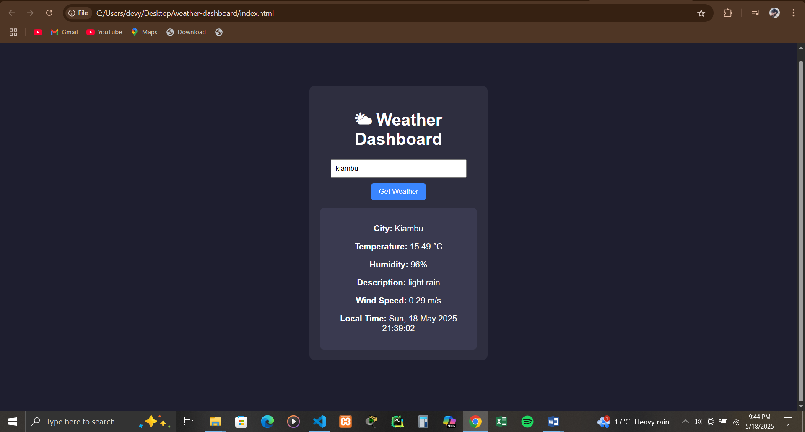

# 🌤 Weather Dashboard

A simple, responsive weather app that fetches real-time weather data using the OpenWeatherMap API. Users can search any city and get temperature, humidity, wind speed, weather description, and local time.

 <!-- Optional: add screenshot -->

## 🔧 Built With

- HTML5
- CSS3 (Dark Theme)
- JavaScript (Vanilla)
- [OpenWeatherMap API](https://openweathermap.org/api)

## 🚀 Features

- Search by city name
- Real-time weather data
- Local time calculation using timezone offset
- Animated loading spinner during fetch
- Responsive and minimal design

## 📦 Installation

1. Clone the repository:
   ```bash
   git clone https://github.com/your-username/weather-dashboard.git
   cd weather-dashboard

---

### 📌 To Use:
1. Save the above as `README.md` in your project folder.
2. Stage + commit it:

```bash
git add README.md
git commit -m "Add project README"
git push

